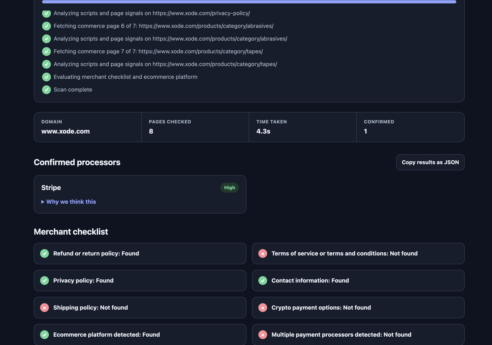

# Merchant Checker

Merchant Checker scans a public merchant website for client-side payment processor evidence, ecommerce platform signals, and basic policy or contact information. It reports the evidence behind every result instead of treating a brand name alone as confirmation. It allows the user to find direct page links and website document locations without the need to dig through the entire website manually. The maximum page dig range can be modified by the user. Remains fully compliant and does not attempt to curve bot-blocking web services. To add features that fall under the grey-area category, the user must modify it by add their own tooling. This version of Merchant Checker does not include any features that could be invasive or abused by the user. General accuracy is not applicable due to this being the standalone version. Accuracy tests can be made after the user adds specific fingerprints, scripts, code, and integration info per desired inspection rule (eg Stripe, Adyen, Upay tracings).



## Install and run

Python 3.11 or newer is recommended.

```text
python3 -m venv .venv
.venv/bin/pip install -r requirements.txt
.venv/bin/uvicorn app.main:app --reload --host 127.0.0.1 --port 8000
```

Open `http://127.0.0.1:8000` in a browser.

Run tests with:

```text
.venv/bin/pytest -q
```

## How detection works

Processor fingerprints live in `app/data/detection_rules.json`. The scanner examines script and iframe sources, form actions, links, explicit JavaScript globals, cookies, response headers, and visible page text.

Each matching rule contributes weighted evidence. Medium or high confidence requires at least one strong integration signal, such as a processor-owned script, hosted payment frame, payment endpoint, or form action. Text and JavaScript-global evidence alone remains low confidence.

- Confirmed processors have medium or high confidence and at least one strong signal.
- Possible mentions contain weak evidence that may reflect an article, comparison, or customer story rather than an active integration.
- Repeated weak evidence is counted once and cannot become confirmed merely by appearing on multiple pages.

The scanner checks the homepage and up to seven same-domain commerce, policy, or contact pages. Results retain the page URL for each piece of evidence.

## Merchant checklist

The checklist reports whether the scanned pages expose:

- Refund or return policy
- Terms of service or terms and conditions
- Privacy policy
- Contact page, email, phone number, or physical address
- Shipping policy
- A supported ecommerce platform
- Multiple confirmed payment processors
- Cryptocurrency payment options

Checklist and platform fingerprints live in `app/data/checklist_rules.json`.

## Safety and privacy

- Only HTTP and HTTPS URLs are allowed.
- Localhost, private, link-local, reserved, and other non-public addresses are blocked.
- DNS is checked again after every redirect.
- Connections are pinned to the validated IP to prevent DNS rebinding.
- TLS certificate and hostname verification remain enabled using the certifi trust bundle.
- Responses have size, redirect, request, page-count, and total-scan limits.
- The API limits each client IP to ten scans per minute and allows four concurrent scans globally.
- Fetching is read-only and uses HTTP GET requests.
- Scanned HTML remains in request-scoped memory and is not written to files or application logs.

## Limitations

- Scripts inserted after JavaScript execution are not visible to this HTML-only scanner.
- Server-side payment integrations may expose no client-side fingerprints.
- A processor may appear only after a cart action or redirect to a hosted checkout.
- The scanner covers at most eight pages, so it may not reach deeply nested checkout or policy pages. (Can be changed by the user as needed, etc.)
- A strong fingerprint proves that client-side integration evidence was present, not that a payment was successfully processed.
- Policy checks confirm visible evidence, not legal adequacy or compliance.

### Accuracy Warning (in process)

Do not treat synthetic fixtures or processor-owned websites as accuracy measurements.
